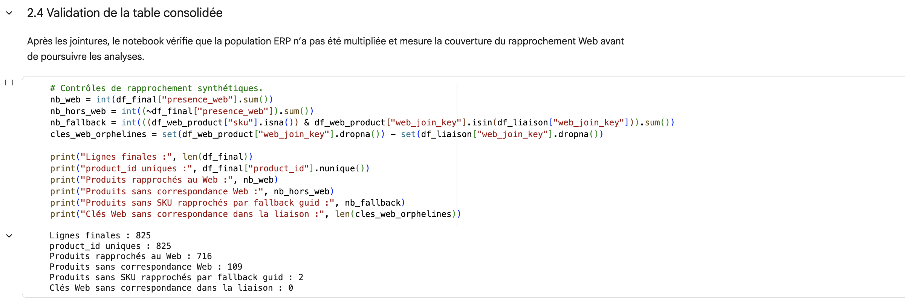
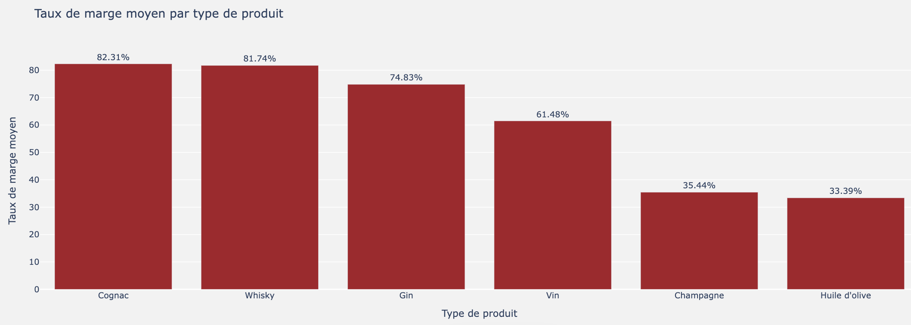
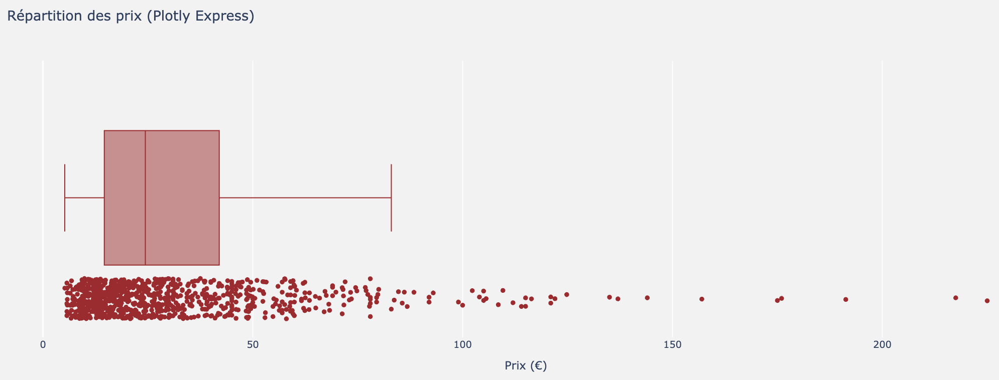

# Analyse de données assistée par l’IA — BottleNeck

Projet d’analyse de données réalisé avec Python à partir de plusieurs sources ERP et Web, puis enrichi à l’aide de l’IA afin d’améliorer la fiabilité du notebook, approfondir certaines analyses et tester de nouvelles approches.

## Objectif

L’objectif du projet est de consolider plusieurs fichiers de suivi afin d’analyser les principaux indicateurs liés :

- aux ventes et au chiffre d’affaires ;
- aux prix ;
- aux stocks ;
- à la rentabilité ;
- aux relations entre les différents indicateurs.

Le notebook initial a ensuite fait l’objet d’une démarche d’amélioration assistée par l’IA, avec une validation systématique des propositions avant leur intégration.

## Données utilisées

Le projet repose sur trois sources :

- **ERP** : 825 produits avec notamment les prix, stocks, statuts de publication et prix d’achat ;
- **Web** : 1 513 lignes et 29 variables issues du site e-commerce ;
- **Fichier de liaison** : 825 lignes permettant de rapprocher les identifiants ERP et Web.

Après rapprochement des sources :

- **825 produits uniques** sont conservés dans la table consolidée ;
- **716 produits** disposent d’une correspondance avec les données Web ;
- **109 produits** restent sans correspondance Web.

> Les fichiers de données sources ne sont pas publiés dans ce dépôt.

## Démarche

### 1. Préparation et fiabilisation des données

- contrôle de l’unicité des identifiants ;
- vérification des valeurs manquantes et incohérentes ;
- contrôle des prix et stocks négatifs ;
- sécurisation des jointures entre les sources ;
- création d’une table consolidée exploitable pour l’analyse.



### 2. Analyse exploratoire et métier

Les analyses portent notamment sur :

- le chiffre d’affaires et les principaux produits contributeurs ;
- les quantités vendues ;
- la logique 20/80 ;
- les niveaux et la rotation des stocks ;
- la valorisation des stocks ;
- les taux de marge ;
- la distribution des prix et la détection de valeurs atypiques.



Les valeurs atypiques de prix sont étudiées à l’aide de méthodes statistiques telles que le **Z-score** et l’**écart interquartile (IQR)**.



### 3. Analyses statistiques

Une matrice de corrélation permet notamment d’observer, sur le jeu de données étudié :

- une corrélation de **+0,40** entre stock et ventes ;
- une corrélation de **-0,46** entre prix et ventes ;
- une corrélation de **-0,09** entre stock et prix.

Ces résultats sont utilisés comme éléments d’analyse et ne sont pas interprétés comme des relations de causalité.

### 4. Enrichissement avec l’IA

L’IA générative a été utilisée comme outil d’assistance pour :

- réaliser une revue critique du notebook ;
- identifier des pistes d’amélioration ;
- aider à la structuration et à la documentation du code ;
- explorer de nouvelles méthodes d’analyse ;
- accompagner les phases de test et d’interprétation.

Les propositions générées n’ont pas été intégrées automatiquement : elles ont été vérifiées et comparées aux résultats existants avant validation.

### 5. Segmentation des produits

Une approche de Machine Learning non supervisé a été testée afin de compléter les analyses métier.

Plusieurs configurations de clustering ont été comparées. Une segmentation **K-Means en deux groupes** a finalement été retenue.

Résultats :

- **score de silhouette : 0,7214** ;
- **685 produits** dans le profil courant du catalogue ;
- **29 produits** identifiés comme « à surveiller en priorité ».

La segmentation est utilisée comme outil de priorisation et non comme mécanisme de décision automatique.


## Technologies utilisées

- Python
- Pandas
- NumPy
- Plotly
- Scikit-learn
- Jupyter Notebook
- IA générative

## Principales compétences mobilisées

- Data Cleaning
- Data Analytics
- Statistics
- Data Visualization
- Machine Learning
- Data Quality
- AI for Data Analysis

## Structure du dépôt

```text
bottleneck-data-analysis-ai/
│
├── README.md
├── requirements.txt
├── notebooks/
│   └── bottleneck_analysis.ipynb
│
└── images/
    ├── validation_table_consolidee.png
    ├── analyse_marge.png
    ├── repartition_prix.png
    └── segmentation_kmeans.png
